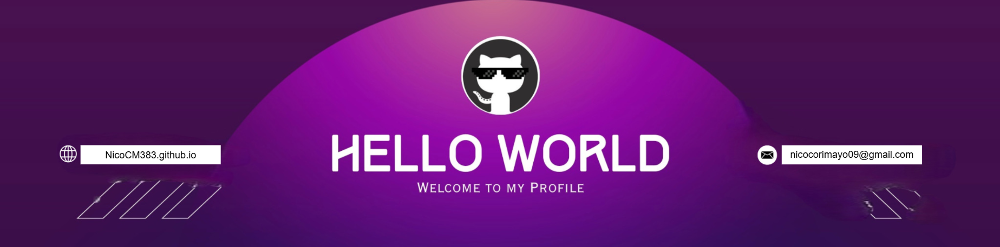

<!--Banner-->

 ## &nbsp;***I'm Nicolás Corimayo***

I'm Machine Learning Engineer specializing in AI, computer vision, and automation. Expert in Python, SQL, NumPy/Pandas, Scikit-learn, TensorFlow/PyTorch, OpenCV, ROS, Docker, FastAPI, Streamlit, and Redis; additional depth in drones (Pixhawk, MAVLink, Raspberry Pi). I worked like AI Developer at DL Consultores, leading autonomous drone safety systems, including the Sentinel for Mining project presented at COPAIPA. Currently, I'm researching high-performance evolutionary computing and completing the last year of my computer engineering degree at Catholic University of Salta.

* **I’m interested in machine learning engineering, computer vision, LLMs (prompting, fine-tuning, RAG), autonomous systems, and AI-driven product development (plus robotics & drones)**.

- 🌱 I’m currently deepening:

  - PyTorch/TensorFlow & scikit-learn (CV pipelines)

  - LLMs: prompt engineering, lightweight fine-tuning (LoRA), retrieval-augmented generation

  - ROS / Pixhawk / MAVLink (autonomy)

  - Evolutionary computing & high-performance optimization

  - MLOps with Docker, FastAPI, Streamlit

  - Automation with n8n and langchain

- 👯 I’m open to collaborating on open-source ML/CV, LLM applications, robotics, and drone autonomy projects.

- ✔ Ask me about Python/SQL, computer vision, LLMs/RAG, ROS, and applied AI for real-world systems.

- Outside tech, 📖 I enjoy reading, 🖌️ painting & sketching, 🎵 music, and 🌴 the outdoors.

 

---

<!--Languages and Tools Section-->       
<h2 align="center">Tᴇᴄʜ sᴛᴀᴄᴋ</h2> 
<picture>
  <source media="(prefers-color-scheme: dark)" srcset="./Skills_Animation_Dark.gif">
  <source media="(prefers-color-scheme: light)" srcset="./Skills_Animation_White.gif">
  
</picture>
 

<h3 align="left">Current Learning</h3>
<ul align="left" style="font-size:20px; line-height:1.6;">
  <li>Exploring advanced React.js patterns and state management techniques.</li>
  <li>Improving my skills in cloud computing with AWS and Azure.</li>
  <li>Building experience with MindSpore.</li>
  <li>Deepening my knowledge in Machine Learning and AI.</li>
  <li>Broadening my knowledge of AI agents and automation.</li>
  <li>Starting in the world of Blockchain.</li>
  <li>Focusing on AI for autonomous drones.</li>
  <li>Specializing in ROS 2.</li>
  <li>Deepening my expertise in project management.</li>
</ul>

<!-- Forzar salto debajo del GIF alineado a la izquierda -->

 

---
<!--Contact Section--> 
<h2 align="center">🤝 Cᴏɴɴᴇᴄᴛ Wɪᴛʜ Mᴇ 🤝 </h2>

  

 

 

	

